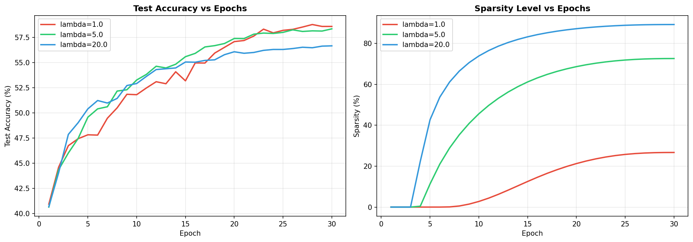
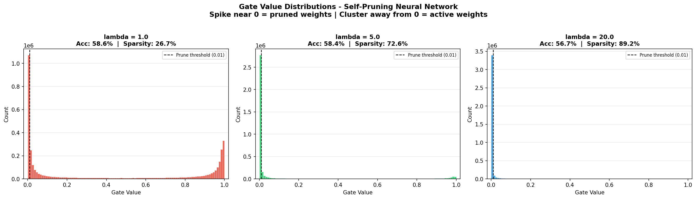

# Tredence AI Engineering Intern — Case Study Submission

Feed-forward neural network that learns to prune its own weights during training using learnable gate parameters and L1 sparsity regularization.

## Overview

Instead of pruning after training, each weight has a learnable gate:

- `gate ~ 1` -> weight stays active
- `gate ~ 0` -> weight is effectively pruned

Core idea:

```text
gate = sigmoid(gate_score)
effective_weight = weight * gate
total_loss = cross_entropy + lambda * sparsity_loss
```

Where:

```text
sparsity_loss = mean(sigmoid(gate_scores))
```

Using the mean keeps sparsity loss scale stable and makes `lambda` easier to tune.

## Project Structure

```text
.
|-- prunable_network.py    # Main implementation
|-- report.md              # Case study report
|-- requirements.txt       # Dependencies
|-- README.md              # Documentation
|-- gate_distribution.png  # Histogram of learned gates
|-- training_curves.png    # Accuracy and sparsity curves
`-- results.json           # Final metrics
```

## Setup and Run

```bash
pip install -r requirements.txt
python prunable_network.py
```

- CIFAR-10 downloads automatically on first run.
- Typical runtime: 10-20 min (CPU), 3-5 min (GPU).

## Results

- `lambda = 1`  -> Accuracy: `58.60%`, Sparsity: `26.68%`
- `lambda = 5`  -> Accuracy: `58.36%`, Sparsity: `72.57%`
- `lambda = 20` -> Accuracy: `56.67%`, Sparsity: `89.18%`

## Observations

- Higher `lambda` increases sparsity.
- Accuracy drops slightly as pruning pressure increases.
- `lambda = 5` gives a strong accuracy/sparsity trade-off.

## Visualizations

### Training Curves



### Gate Distribution



## Key Concepts

### PrunableLinear

- Drop-in linear layer with one trainable gate per weight.
- Effective weights are computed as `weight * sigmoid(gate_scores)`.

### Sparsity Regularization

- L1-style objective on gates pushes unimportant connections toward zero.
- Mean aggregation prevents sparsity term from overwhelming CE loss.

### Training Strategy

- Optimizer: Adam
- Separate learning rates:
  - weights/biases: `1e-3`
  - gate scores: `1e-2`
- Scheduler: cosine annealing

## Requirements

- Python 3.8+
- PyTorch 2.0+
- torchvision
- numpy
- matplotlib
